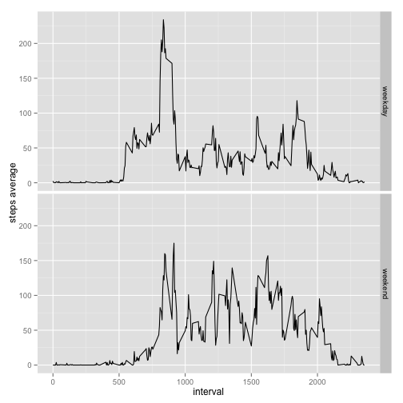

## Loading and preprocessing the data
Read into *data*

```r
data <- read.csv("activity.csv")
data$date <- as.Date(data$date, format = "%Y-%m-%d")
```


## What is mean total number of steps taken per day?
### Histogram for Steps

```r
library(ggplot2)
hist(data$steps[!is.na(data$steps)], main="Histogram of steps", xlab="Steps")
```

 

  
### Mean and Median for Steps
Here is code for mean and median:

```r
        meanSteps <- mean(data$steps, na.rm=T)
        medianSteps <- median(data$steps, na.rm=T)
```
meanSteps = 37.3825996 and medianSteps = 0

## What is the average daily activity pattern?
### Plot for Average Daily Activity
Code for the plot for Average Daily Activity:

```r
        steps_means <- aggregate(data$steps, list(interval=data$interval), mean, na.rm=T)
        plot(steps_means$interval, steps_means$x, type='l', xlab="interval", ylab="steps average", main="Average Daily Activity")
```

 

### Maximum Average Activity and Its Interval
Code for maximum average activity and its interval

```r
        index <- which.max(steps_means$x)
        maximum <- steps_means$x[index]
        interval <- steps_means$interval[index]
```

Maximum average activity = 206.1698113 and its interval = 835

## Imputing missing values
### Total No of missing values
Code for Total No of missing values

```r
        totalNAs <- sum(is.na(data))
```
Total NAs = 2304

### Strategy for filling missing values
We replace each NA for a step by its interval's average.

### Code for filling missing values

```r
# This function is used on the members of the list resultant from splitting data based on 
# interval. x has same structure as the structure of data. x corresponds to particular interval.
# The interval can be found from x$interval, which has the same value in all its entries
# by virtue of splitting done on the basis of data$interval
replaceNAs <- function(x) {        
        interval <- x$interval[1]
        index <- which(steps_means$interval == interval)
        x$steps[is.na(x$steps)] <- steps_means$x[index]
        x
        }        

# Split data based on intercal
split_data <- split(data, data$interval)
# Replace NAs by activity average using interval-wise grouping of data
split_data_without_NAs <- lapply(split_data, replaceNAs)
# Merge interval-wise grouping of data
new_data <- do.call(rbind, split_data_without_NAs)
```

### New Data Histogram for Steps

```r
        # Plot histogram for data without NAs
        hist(new_data$steps, main="New Data Histogram of steps", xlab="steps")
```

 

  
This histogram is slightly different due to 2304 NAs that are being replaced with activity avearages.
  
### New Data Mean and Median for Steps
Here is code for the new mean and new median:

```r
        # calculate new mean
        new_meanSteps <- mean(new_data$steps)
        # Calcualte new median
        new_medianSteps <- median(new_data$steps)
```
meanSteps = 37.3825996 and medianSteps = 0  
new_meanSteps = 37.3825996 and new_medianSteps = 0

Replacing NAs by their average steps have not made a difference, though there is a difference in the totals with or without NAs.


## Are there differences in activity patterns between weekdays and weekends?
### Code to plot the activity averages by interval and datetype

```r
        # Create additional column datatype to indicate whether a date is weekday or weekend
        data$datetype <- ifelse ( weekdays(data$date) %in% c("Saturday", "Sunday"), 
                                  "weekend", "weekday")

        # Aggregate Steps by interval and datetype
        steps_means_datetype <- aggregate(data$steps, list(interval=data$interval, 
                                          datetype = data$datetype), mean, na.rm=T)

        # change column name x to NumberOfSteps
        colnames(steps_means_datetype)[3] <- "NumberOfSteps"

        # Plot the graph
        g <- ggplot(steps_means_datetype, aes(x=interval, y=NumberOfSteps)) + geom_line()
        g + facet_grid(datetype ~ .) + labs(x = "interval", y = "steps average")
```

 

There are differences in activity patterns for weekdays and weekend. In the weekdays, more activities are done on the average before the interval 1000. But, on the weekend, more activities on the average between itervals 1000 and 2000 on the whole.
